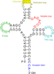

## About me

I am an Algorithm Developer working in the convex hull of algorithmic
discrete mathematics, optimisation and software development. I have
studied mathematics and computer science with a focus in combinatorial
optimisation and multicriteria linear optimisation. I have received a
[PhD](https://depositonce.tu-berlin.de/bitstream/11303/10282/4/schenker_sebastian.pdf)
from TU Berlin. You can also find me on
[linkedin](https://uk.linkedin.com/in/sebastian-schenker).

## Curriculum vitae

|  |  |
|:------------- | :------------- |
| 2018 - present | Algorithm developer at [Satalia](https://www.satalia.com) |
| 2012 - 2017 | Research assistant at [ZIB](https://www.zib.de) and [TU Berlin](https://www.tu-berlin.de) |
| 2011 | Research assistant at University of Coimbra in [Portugal](https://www.asbestian.de/portugal.php) |
| 2003 - 2010 | Studies in mathematics / computer science in Germany, [Romania](https://www.asbestian.de/romania.php), and [Hungary](https://www.asbestian.de/hungary.php) |

## Projects and interests

###  Lot sizing

Out of personal interest I started working on the discrete,
single-machine, multi-item, single-level lot sizing problem. I have
implemented a [heuristic
approach](https://github.com/asbestian/lot-sizing) which is based on
inspecting directed cycles in a residual graph which represents (all)
feasible schedules. I have also implemented some well-known [mip
formulations](https://github.com/asbestian/lot_sizing).

&nbsp;
###  Multicriteria optimisation 

During my time at [ZIB](https://www.zib.de) I was the main developer
of [PolySCIP](https://polyscip.zib.de), a solver for multicriteria
linear and multicriteria integer programs. PolySCIP is now part of the
[SCIP](https://scip.zib.de) Optimisation Suite.

&nbsp;
###  Multiple sequence alignment

There is a nice
[paper](https://link.springer.com/article/10.1007%2Fs10107-005-0659-3)
on a branch-and-cut algorithm for solving the multiple sequence
alignment problem. During a research stay at the University of Coimbra
I implemented the [separation
routines](https://github.com/asbestian/multiple-sequence-alignment)
described in above paper.

## Beautiful algorithms

* [Simplex algorithm](https://en.wikipedia.org/wiki/Simplex_algorithm)
* [Double description method](https://link.springer.com/chapter/10.1007/3-540-61576-8_77)
* [Merge sort](https://en.wikipedia.org/wiki/Merge_sort)

## Links

* non-work related [personal webpage](https://www.asbestian.de)

